# setup手順

## Kibana Visualize 定義

ツール実行時のCPU使用率、メモリ使用量に関する時系列データを表示するための Kibana Visualize 画面を以下の手順で作成する。

1. メトリクスデータを保存した Elasticsearch の Kibana ダッシュボードにアクセスする。

2. `Visualize` メニューを開く

    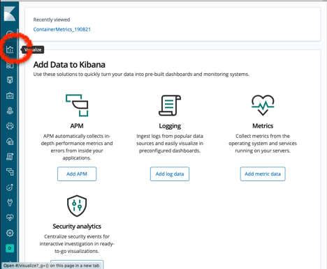

3. 新規 `Visualize` 作成

    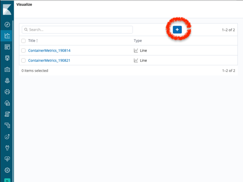

4. Line 種別を指定

    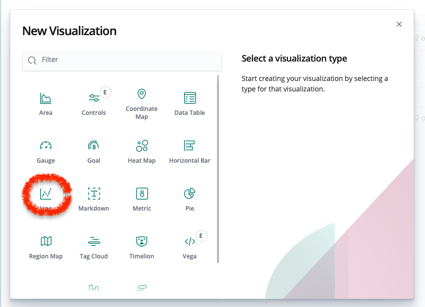

5. 表示対象の Index 名として `telegraf` を選択

    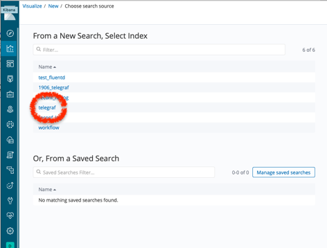

6. Y軸(Y-Axis) の定義

    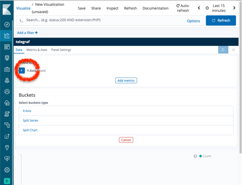

    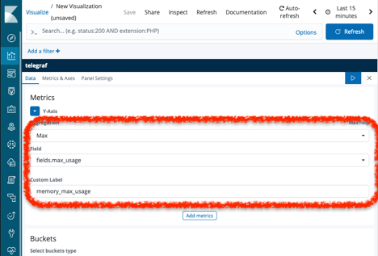

    ```
    Y-Axis
    Aggregation: Max
    Field: fields.max_usage
    Custom Label: memory_max_usage
    ```

7. 他のY軸を追加

    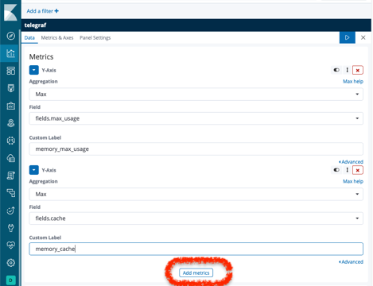

    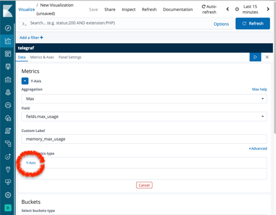

    ```
    Y-Axis
    Aggregation: Max
    Field: fields.cache
    Custom Label: memory_cache
    ```
    ```
    Y-Axis
    Aggregation: Max
    Field: fields.limit
    Custom Label: memory_limit
    ```
    ```
    Y-Axis
    Aggregation: Max
    Field: fields.usage_percent
    Custom Label: cpu_usage_percent
    ```

8. X軸の定義

    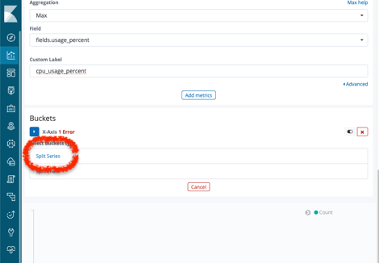

    ```
    X-Axis
    Aggregation: Date Histogram
    Field: timestamp
    Interval: Auto
    ```

    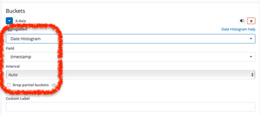


9. `Metrics & Axes > Metrics` を設定

    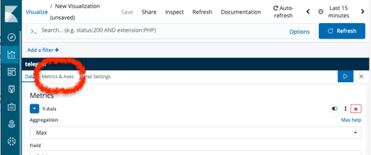

    `cpu_usage_percent` のみ Value Axis を RightAxis-1 に設定

    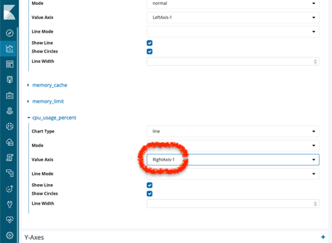

    `memory_limit` のみ Line Mode=stepped,  Line Width=0.5 を設定

    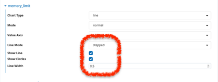

10. 名前を付けて Visualize 画面を Save する

    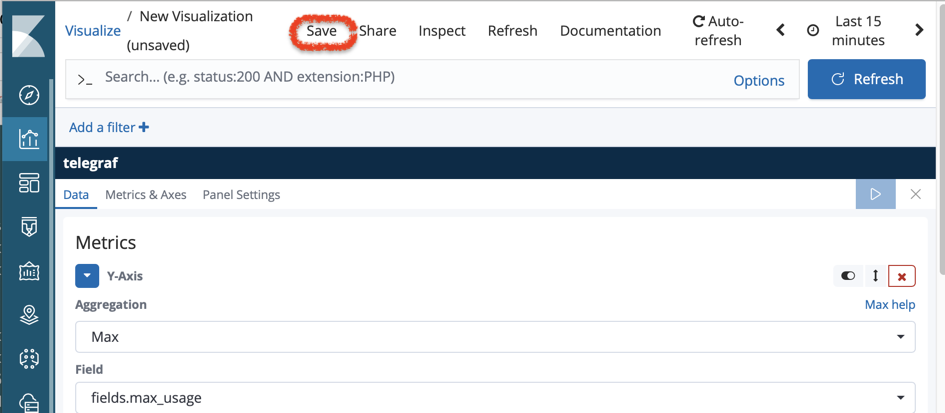
    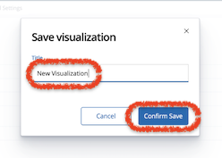


## Elasticsearch エンドポイント指定

DrillHawk がデータを取得する MetricsServer (Elasticsearch) のエンドポイントは、
`docker-compose.yml` の環境変数 `environment` として設定する。

docker-compose.yml の設定例:

```
environment:
  ES_ENDPOINT=XX.XX.XX.XX:9200
  ES_INDEX_NAME=workflow
```

# DrillHawk サーバ起動手順

Docker Compose により Web アプリケーションを起動する。

```
git clone git@bitbucket.org:dynreconf/drill-hawk.git
cd drill-hawk
docker-compose up -d
```

下記のdocker-compose.yml の設定により、 <http://localhost:5001/dh> にアクセス可能となる。

```
    ports:
      # flask port 5000 -> local 5001
      - "5001:5000"
```

# Web UI機能

## ワークフローリスト画面

Elasticsearchに保存されているワークフローのリスト表示。

以下の検索条件で絞り込みが可能。

- キーワード
    * workflow.cwl_file (ワークフロー名)
    * workflow.inputs.filename (入力データ名)
    * workflow.outputs.filename (出力データ名)

- ワークフローの開始日の期間


リスト左のチェックボックスをチェックし、リスト左上のプルダウンを選択することで、
チェックしたワークフローの詳細画面に遷移する。


## ワークフロー詳細画面

リスト表示において選択した各ワークフローの詳細表示画面。複数のワークフローの同時表示が可能。


ワークフローの棒グラフ上でのマウスオーバーにより、当該ステップの詳細情報をツールチップとして表示する。


ワークフローの棒グラフ上で prepare, reconf 以外のステップをマウスクリックすることにより、当該ツール実行時のCPU使用率、メモリ使用量に関する時系列データを表示する。


