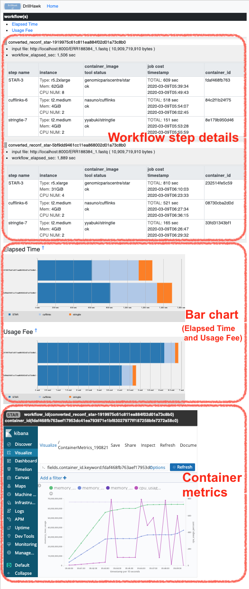
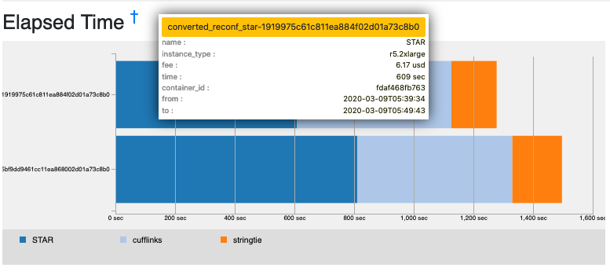

# DrillHawk Users Manual

## Installation and Configuration

### Configure Kibana Visualization

Elasticsearch に保存されている Workflow メトリクスを可視化するためのツールとして Kibana を活用し、Workflow の各ステップで実行されたコンテナの CPU 使用率やメモリ使用量に関する時系列データを表示する。

まず、最初に Kibana Visualization 機能を以下の手順で設定する。

#### Visualization 設定ファイルの編集

- Kibana > Management > Saved Objects の管理画面を開き、Kibana の管理下にある Elasticsearch のインデックス `telegraf` に対応する ID を確認する。

    

- DrillHawk の配布ソースコードに含まれる `KibanaVisualizeObject.json` ファイルをエディタで開き、Telegraf インデックスに対応する ID を修正して保存する。

    

#### Visualization 設定ファイルのインポート

- Saved Objects 管理画面にある Import 機能を用いて、設定ファイル `KibanaVisualizeObject.json` をアップロードする。
  - Import が成功すると、 `VisualizeForDrillHawk_200301` という Title の Visualization が新たに追加される。 (Kibana > Visualize メニュー)

### Configure Environment Variables

DrillHawk のデータ取得先となる Elasticsearch および Kibana のエンドポイントを `.env` ファイルに記述する。

- `docker.env.example` ファイルをコピーして `.env` ファイルを作成し、以下の環境変数を指定する。
  - ES_ENDPOINT
    - Elasticsearch の IPアドレスとポート番号を指定する。 e.g. `10.0.0.100:9200`
  - KIBANA_ENDPOINT
    - Kibana の IPアドレスとポート番号を指定する。 e.g. `10.0.0.100:5601`
  - ES_INDEX_NAME
    - Workflow 情報を保存した Elasticsearch インデックス名を指定する e.g. `workflow`

## Run DrillHawk

Docker Compose により DrillHawk の Web アプリケーションを起動する。

```
docker-compose up -d
```

## Web Interface

Web UI を利用するには、ブラウザから以下の URL にアクセスする。

<http://{running-host-ip}:5001/dh/>

### ワークフローリスト画面

Elasticsearchに保存されているワークフローのリスト表示。

以下の検索条件で絞り込みが可能。

- キーワード
    * workflow.cwl_file (ワークフロー名)
    * workflow.inputs.filename (入力データ名)
    * workflow.outputs.filename (出力データ名)

- ワークフローの開始日の期間


リスト左のチェックボックスをチェックし、リスト左上のプルダウンを選択することで、
チェックしたワークフローの詳細画面に遷移する。


### ワークフロー詳細画面

リスト表示において選択した各ワークフローの詳細表示画面。複数のワークフローの同時表示が可能。



- Workflow step details

    

- Bar chart (Elapsed Time or Usage Fee)

    

ワークフローの棒グラフ上でのマウスオーバーにより、当該ステップの詳細情報をツールチップとして表示する。



ワークフローの棒グラフ上で色分けされたステップをマウスクリックすることにより、ステップで実行されたツールのコンテナメトリクス(CPU使用率, メモリ使用量) の時系列データを表示する。


